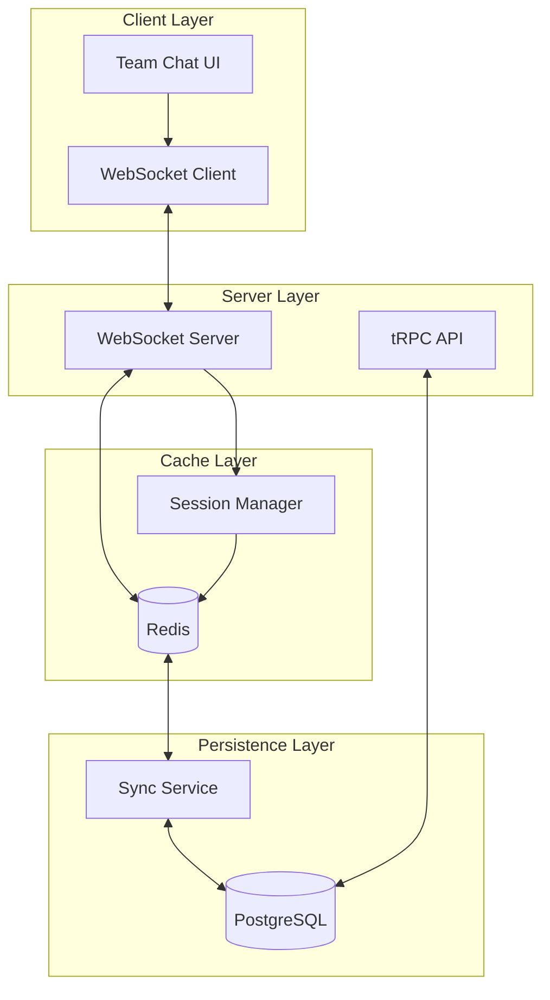

# Redis-Based Instant Chat Implementation Plan

## Overview

This document outlines the implementation plan for enhancing the team chat feature with Redis-based instant messaging. The team chat feature enables multiple team members to collaborate with AI in a shared conversation - where team members ask questions and the AI responds to help with brainstorming, planning, and problem-solving. The system will use Redis as a fast cache layer for these AI collaboration sessions, keeping messages in Redis for 20 minutes to reduce database operations and improve performance. After 20 minutes of inactivity, messages are automatically synced to the database and removed from Redis.

## Architecture Overview



## Key Components

### 1. Redis Session Management

#### Session Structure
```typescript
interface ChatSession {
  sessionId: string;
  teamChatId: string;
  participants: string[];
  messages: MessageData[];
  createdAt: number;
  lastActivityAt: number;
  expiresAt: number;
  status: 'active' | 'syncing' | 'expired';
}

interface MessageData {
  id: string;
  content: string;
  userId: string;
  timestamp: number;
  type: 'user' | 'assistant' | 'system';
  metadata?: any;
  syncedToDb?: boolean;
}
```

### 2. Session Lifecycle

#### Session States
- **Active**: Chat messages cached in Redis (refreshed on each message)
- **Idle**: No activity for 20 minutes (ready for sync)
- **Syncing**: Being persisted to database
- **Cleared**: Removed from Redis after DB sync

#### Transition Flow
```
User opens chat → Check Redis → If not in Redis → Load last 50 messages from DB → Cache in Redis
                      ↓
              If in Redis → Use cached messages
                      ↓
              User sends message → Save to Redis → Reset 20min timer → Broadcast via WebSocket
                      ↓
              20 min no activity → Sync to DB → Clear from Redis
```

#### Key Principles
- Redis stores up to 1000 most recent messages per chat (team member questions + AI responses)
- Each message activity resets the 20-minute timer (timer is from LAST ACTIVITY, not chat start)
- WebSocket broadcasts happen independently of database writes
- Redis acts as a write buffer to batch database operations
- Messages NEVER disappear from user's view - seamless transition between Redis and DB
- All team members in the chat see both user questions and AI responses in real-time

## Implementation Steps

### Phase 1: Redis Session Infrastructure

#### 1.1 Create Session Manager Service
```typescript
// src/services/sessionManager.ts
export class SessionManager {
  private redisService: OptimizedRedisService;
  private syncService: SyncService;
  
  async createSession(teamChatId: string): Promise<ChatSession>
  async getSession(teamChatId: string): Promise<ChatSession | null>
  async updateSession(teamChatId: string, messages: MessageData[]): Promise<void>
  async expireSession(teamChatId: string): Promise<void>
  async loadSessionFromDb(teamChatId: string): Promise<ChatSession | null>
}
```

#### 1.2 Enhance Redis Service
```typescript
// Add to optimized-redis-service.ts
async setSession(session: ChatSession): Promise<void>
async getSession(sessionId: string): Promise<ChatSession | null>
async appendMessages(sessionId: string, messages: MessageData[]): Promise<void>
async getAllActiveSessions(): Promise<ChatSession[]>
```

### Phase 2: WebSocket Integration

#### 2.1 Modify WebSocket Server
```typescript
// Enhanced message handling
socket.on('message:send', async (message) => {
  // 1. Check if session exists in Redis
  let session = await sessionManager.getSession(message.teamId);
  
  // 2. If no session, check DB and create new session
  if (!session) {
    session = await sessionManager.loadSessionFromDb(message.teamId) 
      || await sessionManager.createSession(message.teamId);
  }
  
  // 3. Add message to Redis session
  await sessionManager.appendMessage(session.sessionId, message);
  
  // 4. Broadcast to all participants
  io.to(message.teamId).emit('message:new', message);
  
  // 5. Reset session expiry timer
  await sessionManager.refreshSession(session.sessionId);
});
```

#### 2.2 Session Expiry Handler
```typescript
// Session expiry monitoring
setInterval(async () => {
  const expiringSessions = await sessionManager.getExpiringSessions();
  
  for (const session of expiringSessions) {
    // 1. Sync to database
    await syncService.syncSessionToDb(session);
    
    // 2. Notify clients
    io.to(session.teamChatId).emit('session:expiring', {
      teamChatId: session.teamChatId,
      syncStatus: 'syncing'
    });
    
    // 3. Remove from Redis after sync
    await sessionManager.expireSession(session.sessionId);
  }
}, 60000); // Check every minute
```

### Phase 3: Client-Side Updates

#### 3.1 Update Team Chat Store
```typescript
// Add to teamChat store
interface TeamChatState {
  // ... existing state
  activeSession: ChatSession | null;
  sessionStatus: 'loading' | 'active' | 'syncing' | 'expired';
  sessionMessages: Record<string, MessageData[]>; // teamChatId -> messages
}

// New actions
loadChatSession: (teamChatId: string) => Promise<void>
syncSessionToDb: (teamChatId: string) => Promise<void>
handleSessionExpiry: (teamChatId: string) => void
```

#### 3.2 Update WebSocket Hook
```typescript
// Enhanced useTeamChatWebSocket
socket.on('session:loaded', (session: ChatSession) => {
  updateSessionMessages(session.teamChatId, session.messages);
  updateSessionStatus('active');
});

socket.on('session:expiring', ({ teamChatId, syncStatus }) => {
  updateSessionStatus('syncing');
  // Show UI notification
});

socket.on('session:expired', ({ teamChatId }) => {
  updateSessionStatus('expired');
  // Clear local cache, reload from DB if needed
});
```

### Phase 4: Database Sync Service

#### 4.1 Create Sync Service
```typescript
// src/services/syncService.ts
export class SyncService {
  async syncSessionToDb(session: ChatSession): Promise<void> {
    try {
      // 1. Batch insert messages
      const unsyncedMessages = session.messages.filter(m => !m.syncedToDb);
      await this.batchInsertMessages(session.teamChatId, unsyncedMessages);
      
      // 2. Update chat metadata
      await this.updateChatMetadata(session.teamChatId, {
        lastActivityAt: session.lastActivityAt,
        messageCount: session.messages.length
      });
      
      // 3. Mark messages as synced in Redis
      await this.markMessagesSynced(session.sessionId, unsyncedMessages);
    } catch (error) {
      // Handle sync errors, retry logic
    }
  }
  
  async loadHistoryFromDb(teamChatId: string, limit: number = 50): Promise<MessageData[]>
}
```

## Edge Cases & Solutions

### Understanding the 20-Minute Timer
- **Important**: Timer is from LAST ACTIVITY, not from chat start
- **Active Chat**: As long as messages are being sent, chat stays in Redis indefinitely
- **Example Timeline**:
  ```
  2:00 PM: Chat starts → Timer: 20 min
  2:05 PM: New message → Timer RESETS to 20 min
  2:10 PM: New message → Timer RESETS to 20 min
  ...
  6:00 PM: Still chatting → Still in Redis (4 hours later!)
  6:00 PM: Last message
  6:20 PM: No activity for 20 min → Sync to DB → Clear from Redis
  
  Next day:
  9:00 AM: User opens same chat → Load from DB → Cache in Redis → Continue
  ```

### 1. Message Limit in Redis (1000 messages)
- **Scenario**: Active team collaboration with AI exceeds 1000 messages (e.g., 2 team members asking AI for help with complex project planning)
- **Solution**: Rolling Window Approach
  ```typescript
  async function addMessage(chatId: string, newMessage: Message) {
    const messageCount = await redis.llen(`chat:${chatId}:messages`);
    
    if (messageCount >= 1000) {
      // Remove oldest message (FIFO)
      const oldestMessage = await redis.lpop(`chat:${chatId}:messages`);
      // Ensure it's saved to DB
      await ensureSavedToDb(oldestMessage);
    }
    
    // Add new message
    await redis.rpush(`chat:${chatId}:messages`, JSON.stringify(newMessage));
    
    // Reset 20-minute timer
    await redis.expire(`chat:${chatId}:messages`, 1200);
  }
  ```
  - Seamless experience: Users never notice the transition
  - Older messages automatically move to database
  - Most recent 1000 always available for fast access

### 2. Automatic Reconnection
- **Scenario**: User goes offline and comes back
- **Solution**:
  ```typescript
  socket.on('connect', async () => {
    // Check if chat exists in Redis
    const cachedMessages = await redis.lrange(`chat:${chatId}:messages`, 0, -1);
    if (cachedMessages.length === 0) {
      // Load last 50 messages from DB
      const dbMessages = await loadRecentMessages(chatId, 50);
      await cacheMessages(chatId, dbMessages);
    }
    // User automatically sees cached messages
  });
  ```

### 3. Multiple Active Sessions (Same Chat)
- **Scenario**: Same chat open in multiple browsers/devices
- **Solution**:
  ```typescript
  // Use a single Redis key per chat, not per session
  const chatKey = `chat:${teamChatId}:messages`;
  // All sessions share the same Redis cache
  // Activity from any session resets the expiry timer
  ```

### 4. Message Loading Strategy
- **Initial Load**: 
  - Check Redis first
  - If empty, load last 50 messages from DB
  - Cache in Redis with 20-minute expiry
  
- **Scroll Up (Load More)**:
  ```typescript
  async loadMoreMessages(chatId: string, beforeMessageId: string) {
    // Always load historical messages from DB
    const historicalMessages = await db.getMessages({
      chatId,
      before: beforeMessageId,
      limit: 50
    });
    // Don't cache historical messages in Redis
    return historicalMessages;
  }
  ```

### 5. Hybrid Message Display
- **Recent Messages** (from Redis): Fast, real-time
- **Historical Messages** (from DB): On-demand loading
- **Seamless Integration**:
  ```typescript
  const displayMessages = [
    ...historicalMessagesFromDB,  // Older messages
    ...cachedMessagesFromRedis     // Recent messages
  ];
  ```

### 6. Handling Long Team + AI Collaboration Sessions
- **Scenario**: Multiple team members working with AI assistant for hours (e.g., developing a product strategy, debugging complex code, or planning a project)
- **Intelligent Sync Strategy**:
  ```typescript
  class TeamAISessionManager {
    private syncThreshold = 800; // Start syncing at 80% capacity
    
    async handleMessage(chatId: string, message: Message) {
      const count = await redis.llen(`chat:${chatId}:messages`);
      
      // Proactive sync when approaching limit
      if (count >= this.syncThreshold && !this.isSyncing(chatId)) {
        // Sync older messages to DB while chat continues
        this.startBackgroundSync(chatId);
      }
      
      // AI responses might be long - handle specially
      if (message.type === 'assistant' && count >= 950) {
        await this.makeRoomForAIResponse(chatId);
      }
      
      // Continue normal operation
      await this.addToRedis(chatId, message);
      await this.broadcast(chatId, message);
    }
  }
  ```

### 7. Continuous Team + AI Session Example
- **Morning Session (3 hours)**:
  - 9:00 AM: Team Member A: "AI, help us design a new e-commerce feature"
  - AI responds with suggestions
  - 9:15 AM: Team Member B: "What about implementing a recommendation system?"
  - AI provides detailed implementation plan
  - 9:00 AM - 12:00 PM: Continuous back-and-forth with AI
  - 2000+ messages exchanged (team questions + AI responses)
  - Latest 1000 in Redis, older in DB
  - No interruption to users
  
- **Afternoon Break**:
  - 12:00 PM: Last message
  - 12:20 PM: Auto-sync to DB, cleared from Redis
  
- **Resume Session**:
  - 2:00 PM: Team returns
  - System loads last 50 messages from DB to Redis
  - Continue seamlessly

## Performance Optimizations

### 1. Redis Optimization
```typescript
// Use Redis pipelines for batch operations
const pipeline = redis.pipeline();
messages.forEach(msg => {
  pipeline.rpush(`session:${sessionId}:messages`, JSON.stringify(msg));
});
pipeline.expire(`session:${sessionId}`, 1200); // 20 minutes
await pipeline.exec();
```

### 2. Message Compression
```typescript
// Compress large messages before storing
import { compress, decompress } from 'lz-string';

const compressedMessage = compress(JSON.stringify(message));
await redis.set(key, compressedMessage);
```

### 3. Connection Pooling
```typescript
// Implement connection pooling for Redis
const redisPool = createPool({
  create: () => Redis.fromEnv(),
  destroy: (client) => client.quit(),
  max: 10,
  min: 2,
});
```

## Monitoring & Metrics

### Key Metrics to Track
1. **Session Metrics**
   - Active sessions count
   - Average session duration
   - Messages per session
   - Sync success rate

2. **Performance Metrics**
   - Redis response time
   - WebSocket latency
   - DB sync duration
   - Message delivery time

3. **Error Metrics**
   - Sync failures
   - Connection drops
   - Session recovery attempts

### Implementation
```typescript
// Metrics collection
interface SessionMetrics {
  sessionId: string;
  startTime: number;
  messageCount: number;
  participantCount: number;
  syncAttempts: number;
  syncSuccess: boolean;
  errorCount: number;
}
```

## Testing Strategy

### 1. Unit Tests
- Session creation/expiry
- Message queuing
- Sync logic
- Error handling

### 2. Integration Tests
- Redis-WebSocket integration
- DB sync process
- Session recovery
- Concurrent user scenarios

### 3. Load Tests
- 1000 concurrent sessions
- 10,000 messages/minute
- Network failure simulation
- Redis memory limits

### 4. E2E Tests
- Complete chat flow
- Multi-user conversations
- Session expiry handling
- Cross-device sync

## Rollout Plan

### Phase 1: Development (Week 1-2)
- Implement SessionManager
- Update Redis service
- Create sync service
- Basic WebSocket integration

### Phase 2: Testing (Week 3)
- Unit & integration tests
- Load testing
- Bug fixes
- Performance optimization

### Phase 3: Staging (Week 4)
- Deploy to staging
- User acceptance testing
- Monitor metrics
- Final adjustments

### Phase 4: Production (Week 5)
- Gradual rollout (10% → 50% → 100%)
- Monitor performance
- Quick rollback plan
- Full deployment

## Configuration

### Environment Variables
```env
# Redis Session Config
REDIS_SESSION_TTL=1200 # 20 minutes in seconds
REDIS_SESSION_SYNC_INTERVAL=300 # 5 minutes
REDIS_SESSION_MAX_MESSAGES=1000
REDIS_SESSION_COMPRESSION=true

# Sync Config
DB_SYNC_BATCH_SIZE=100
DB_SYNC_RETRY_ATTEMPTS=3
DB_SYNC_RETRY_DELAY=1000

# Monitoring
ENABLE_SESSION_METRICS=true
METRICS_COLLECTION_INTERVAL=60000
```

## Migration Guide

### For Existing Chats
1. Continue reading from DB for historical messages
2. New messages go to Redis first
3. Gradual migration of active chats
4. No disruption to users

### Database Schema Updates
```sql
-- Add session tracking
ALTER TABLE team_chats ADD COLUMN last_session_id VARCHAR(255);
ALTER TABLE team_chats ADD COLUMN session_count INTEGER DEFAULT 0;

-- Add sync status to messages
ALTER TABLE team_chat_messages ADD COLUMN sync_source VARCHAR(50) DEFAULT 'direct';
ALTER TABLE team_chat_messages ADD COLUMN session_id VARCHAR(255);

-- Create session history table
CREATE TABLE team_chat_sessions (
  id VARCHAR(255) PRIMARY KEY,
  team_chat_id VARCHAR(255) NOT NULL,
  started_at TIMESTAMP NOT NULL,
  ended_at TIMESTAMP,
  message_count INTEGER DEFAULT 0,
  participant_count INTEGER DEFAULT 0,
  sync_status VARCHAR(50),
  metadata JSONB
);
```

## Security Considerations

1. **Data Encryption**
   - Encrypt sensitive messages in Redis
   - Use TLS for Redis connections
   - Implement key rotation

2. **Access Control**
   - Validate user permissions per session
   - Rate limiting per user
   - Session hijacking prevention

3. **Data Privacy**
   - Auto-delete expired sessions
   - GDPR compliance for data retention
   - User data export capabilities

## Future Enhancements

1. **Advanced Features**
   - Message reactions in Redis
   - Read receipts optimization
   - Typing indicators caching
   - File upload sessions

2. **Scalability**
   - Redis Cluster support
   - Horizontal scaling
   - Geographic distribution
   - Multi-region sync

3. **Analytics**
   - Real-time chat analytics
   - User engagement metrics
   - Performance dashboards
   - ML-based insights

## Implementation Details

### Redis Data Structure
```typescript
// Message storage in Redis
Key: `chat:{teamChatId}:messages`
Type: List
Value: JSON stringified messages
TTL: 20 minutes (refreshed on each new message)

// Chat metadata
Key: `chat:{teamChatId}:meta`
Type: Hash
Fields:
  - lastActivity: timestamp
  - messageCount: number
  - participants: JSON array of user IDs
  - syncStatus: 'active' | 'syncing' | 'synced'
```

### Message Flow Architecture for Team + AI Chat
```typescript
// 1. Team member sends question to AI
teamMember.sendMessage("AI, how should we implement this feature?") 
  → WebSocket.emit('message:send')
  → Server.saveToRedis(userMessage)
  → Server.broadcastToRoom(userMessage) // Other team members see the question
  → Server.triggerAIResponse()
  → AI.generateResponse()
  → Server.saveToRedis(aiResponse)
  → Server.broadcastToRoom(aiResponse) // All team members see AI's answer
  → Server.resetExpiry(chatId, 20min)
  
// 2. Background sync (every minute)
SyncWorker.checkIdleChats()
  → Find chats idle for 20+ minutes
  → Batch sync to database
  → Clear from Redis
  
// 3. User opens chat
user.openChat(chatId)
  → Check Redis cache
  → If empty: Load last 50 from DB → Cache in Redis
  → If exists: Use Redis cache
  → Subscribe to WebSocket room
```

### Database Operations Optimization
```typescript
// Before (immediate DB writes)
- User sends message → Write to DB → Broadcast
- 100 messages = 100 DB writes

// After (Redis buffer)
- User sends message → Write to Redis → Broadcast
- 100 messages = 1 batch DB write (after 20 min)
- 95% reduction in DB operations
```

## Conclusion

This implementation plan provides a robust foundation for Redis-based instant messaging with automatic database synchronization. The system is designed to be scalable, reliable, and performant while maintaining data consistency and providing a seamless user experience.
