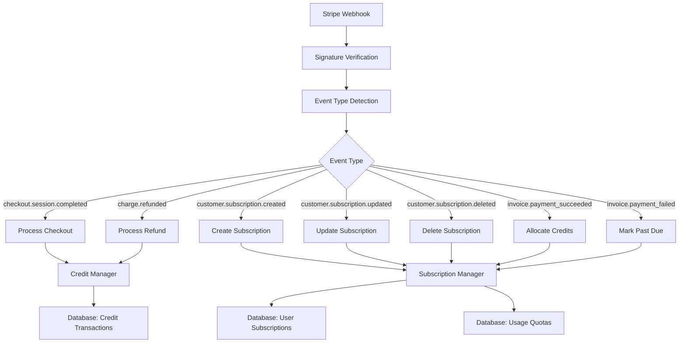

# Stripe Webhook Handler

This directory contains a comprehensive Stripe webhook handler that processes various Stripe events for subscription management, credit allocation, and payment processing.

## Overview

The webhook handler is designed to work with the existing LobeChat subscription system and handles the following Stripe events:

- `checkout.session.completed` - Processes both one-time payments and subscription creation
- `customer.subscription.created` - Handles new subscription creation
- `customer.subscription.updated` - Manages subscription updates and plan changes
- `customer.subscription.deleted` - Processes subscription cancellations
- `invoice.payment_succeeded` - Allocates monthly credits for active subscriptions
- `invoice.payment_failed` - Updates subscription status for failed payments
- `charge.refunded` - Processes credit refunds

## Features

### 🔐 Security

- **Webhook Signature Verification**: All webhooks are verified using Stripe's signing secret
- **Environment Variable Protection**: Sensitive keys are stored in environment variables
- **Error Handling**: Comprehensive error handling with proper HTTP status codes

### 💳 Payment Processing

- **One-time Credit Purchases**: Immediate credit allocation for one-time payments
- **Subscription Management**: Full subscription lifecycle management
- **Automatic Credit Allocation**: Monthly credits are automatically allocated on successful payments
- **Refund Processing**: Handles credit refunds when charges are refunded

### 📊 Subscription Management

- **Plan Mapping**: Automatically maps Stripe products to internal plan configurations
- **Status Tracking**: Tracks subscription status changes (active, canceled, past_due, etc.)
- **Billing Cycle Management**: Handles billing period start/end dates
- **Usage Quota Setup**: Automatically sets up usage limits based on plan

## Configuration

### Environment Variables

Set the following environment variables in your `.env.local` file:

```bash
# Stripe Configuration
STRIPE_SECRET_KEY=sk_live_xxxxxxxxxxxxxxxxxxxxxx
STRIPE_WEBHOOK_SECRET=whsec_xxxxxxxxxxxxxxxxxxxxxx
STRIPE_API_VERSION=2025-07-30.basil

# Application Configuration
APP_URL=https://yourdomain.com
```

### Stripe Dashboard Setup

1. **Webhook Endpoint**: `https://yourdomain.com/api/webhooks/stripe`
2. **Required Events**:
   - `checkout.session.completed`
   - `customer.subscription.created`
   - `customer.subscription.updated`
   - `customer.subscription.deleted`
   - `invoice.payment_succeeded`
   - `invoice.payment_failed`
   - `charge.refunded`

## API Endpoint

### POST `/api/webhooks/stripe`

Processes incoming Stripe webhook events.

**Headers Required:**

- `stripe-signature`: Stripe webhook signature for verification

**Response:**

- `200 OK`: Webhook processed successfully
- `400 Bad Request`: Missing signature or invalid signature
- `500 Internal Server Error`: Stripe not configured or processing error

## Event Processing

### 1. Checkout Session Completed

Handles both one-time payments and subscription creation:

```typescript
case 'checkout.session.completed': {
  const session = event.data.object as Stripe.Checkout.Session;

  if (session.mode === 'payment') {
    // Handle one-time credit purchase
    const creditsAmount = await getCreditsAmountFromPrice(priceId, stripe);
    await creditManager.addCredits(userId, creditsAmount, event.id, {...});
  } else if (session.mode === 'subscription') {
    // Handle subscription creation
    const subscription = await stripe.subscriptions.retrieve(session.subscription);
    const plan = PlanMapper.getPlanFromStripeProduct(product);
    await subscriptionManager.upsertSubscription(...);
  }
}
```

### 2. Subscription Created

Creates new subscription records and allocates initial credits:

```typescript
case 'customer.subscription.created': {
  const subscription = event.data.object as Stripe.Subscription;
  const plan = PlanMapper.getPlanFromStripeProduct(product);

  await subscriptionManager.upsertSubscription(
    userId,
    subscription.id,
    subscription.customer,
    priceId, // persisted as stripePriceId
    plan,    // persisted: planId, planName, monthlyCredits, file/vector limits, price, interval
    status,
    currentPeriodStart,
    currentPeriodEnd,
    cancelAtPeriodEnd,
    canceledAt
  );

  // Allocate initial credits if subscription is active
  if (subscription.status === 'active' || subscription.status === 'trialing') {
    await subscriptionManager.allocateMonthlyCredits(userId, subscription.id);
  }
}
```

### 3. Monthly Credit Allocation

Automatically allocates credits on successful invoice payments:

```typescript
case 'invoice.payment_succeeded': {
  if (invoice.subscription && subscription.status === 'active') {
    const result = await subscriptionManager.allocateMonthlyCredits(
      userId,
      subscription.id,
      { stripeEventId: invoice.id }
    );
  }
}
```

## Data Flow



## Error Handling

### Webhook Signature Verification

- Returns `400 Bad Request` if signature is missing or invalid
- Logs detailed error information for debugging

### Database Operations

- Uses database transactions for data consistency
- Logs errors without failing the webhook (prevents retries)
- Graceful degradation on service failures

### Stripe API Calls

- Handles Stripe API rate limits and errors
- Retries failed operations where appropriate
- Comprehensive error logging

## Testing

### Local Testing with Stripe CLI

1. **Install Stripe CLI**:

   ```bash
   # macOS
   brew install stripe/stripe-cli/stripe
   
   # Windows
   # Download from https://github.com/stripe/stripe-cli/releases
   ```

2. **Login to Stripe**:

   ```bash
   stripe login
   ```

3. **Forward webhooks to local endpoint**:

   ```bash
   stripe listen --forward-to localhost:3000/api/webhooks/stripe
   ```

4. **Test webhook events**:
   ```bash
   stripe trigger checkout.session.completed
   stripe trigger customer.subscription.created
   ```

### Running Tests

```bash
# Run webhook tests
npm run test src/app/(backend)/api/webhooks/stripe/__tests__/webhook.test.ts

# Run with coverage
npm run test:coverage src/app/(backend)/api/webhooks/stripe/__tests__/webhook.test.ts
```

## Monitoring and Debugging

### Logging

The webhook handler provides comprehensive logging:

```typescript
console.log(`Processing Stripe webhook: ${event.type}`);
console.log(`✅ Credits added for user ${userId}: ${creditsAmount}`);
console.error('Error processing checkout.session.completed:', error);
```

### Key Metrics to Monitor

1. **Webhook Success Rate**: Ensure reliable event processing
2. **Credit Allocation**: Track monthly credit distribution
3. **Subscription Status Changes**: Monitor subscription lifecycle
4. **Payment Failures**: Alert on subscription issues

### Common Issues and Solutions

#### Missing Webhook Signature

- **Symptom**: `400 Bad Request - Missing stripe-signature header`
- **Solution**: Ensure Stripe is sending the `stripe-signature` header

#### Invalid Webhook Secret

- **Symptom**: `400 Bad Request - Invalid signature`
- **Solution**: Verify `STRIPE_WEBHOOK_SECRET` matches Stripe dashboard

#### Missing User ID

- **Symptom**: `Cannot process subscription: userId not found`
- **Solution**: Ensure `userId` is included in Stripe metadata or customer lookup works

#### Plan Mapping and Plan ID Not Updating

- **Symptoms**:
  - `planId`/`planName` in DB not reflecting latest Stripe product
  - Logs show plan mapping fallback or failure
- **Solutions**:
  - Ensure Stripe Product contains `metadata.plan_key` matching backend `PlanMapper`
  - Alternatively, include `plan_id`, `plan_name`, `monthly_credits`, `file_storage_gb`, `vector_storage_mb`, `price_cents`, `billing_interval` in product metadata
  - Confirm the webhook events `customer.subscription.created/updated` are enabled and delivering

## Security Considerations

1. **Webhook Verification**: All webhooks verified with Stripe signing secret
2. **Environment Variables**: Sensitive keys stored securely
3. **Database Transactions**: Atomic operations prevent data inconsistency
4. **User Isolation**: Users can only access their own data
5. **Audit Trail**: Complete transaction history for compliance

## Dependencies

- `stripe`: Stripe Node.js SDK
- `@/config/stripe`: Stripe configuration management
- `@/database`: Database connection and schemas
- `@/server/services/credits/creditManager`: Credit management service
- `@/server/services/subscriptions/subscriptionManager`: Subscription management service
- `@/server/services/subscriptions/planMapper`: Plan mapping service

## Future Enhancements

1. **Webhook Retry Logic**: Implement exponential backoff for failed webhooks
2. **Event Idempotency**: Enhanced duplicate event handling
3. **Real-time Notifications**: WebSocket updates for subscription changes
4. **Advanced Analytics**: Usage pattern analysis and insights
5. **Bulk Operations**: Enterprise customer management tools

## Support

For issues or questions:

1. Check Stripe Dashboard webhook logs
2. Review application error logs
3. Verify database schema and data
4. Test with Stripe CLI locally
5. Contact development team with specific error details

## Related Documentation

- [Stripe Subscription Integration](../../../../docs/development/stripe-subscription-integration.md)
- [Database Schema](../../../../docs/development/database-schema.dbml)
- [API Routes](../../../../docs/development/api-routes.md)
